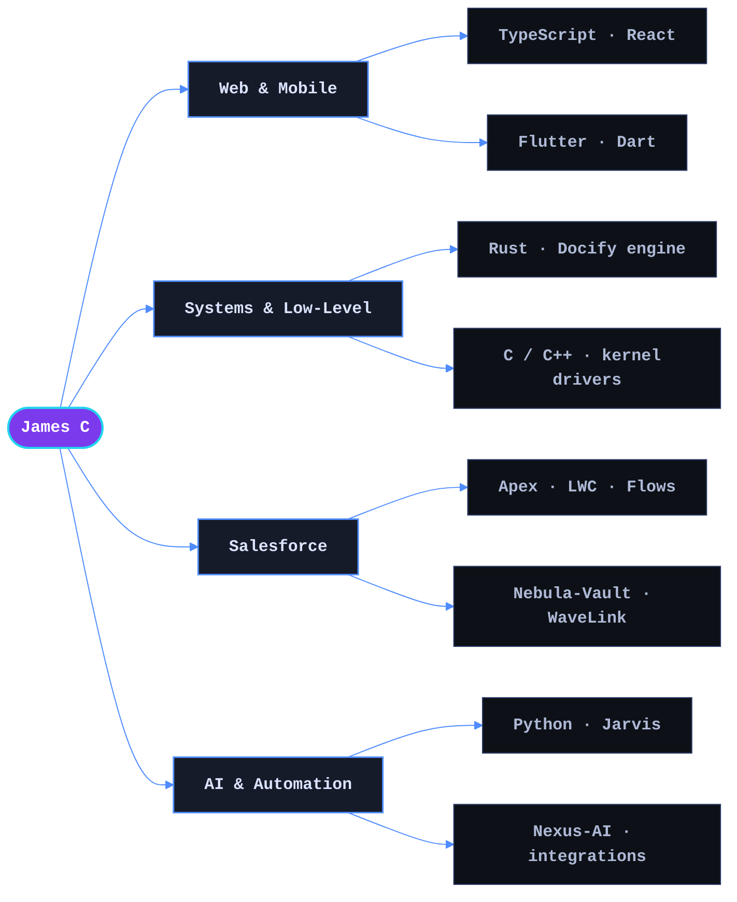

<!-- ════════════════════════════════════════════════════════════════
     JAMES C · GitHub Profile
     The whole hero — identity, what I build, and stack — is folded
     into one continuous animated card at ./assets/header.svg
════════════════════════════════════════════════════════════════ -->

<div align="center">
  <a href="https://github.com/Exotic209093">
    
  </a>
</div>

<p align="center">
  
  
</p>

---

## 🗺️ How It All Fits Together



---

## 🧰 Tools & Platforms

<div align="center">
  
  
  
  
  
  
  
  
  
  
  
  
  
  
  
  
  
</div>

---

## 🚀 Featured Projects

<table>
  <tr>
    <td width="50%" align="center">
      <a href="https://github.com/Exotic209093/Docify">
        
      </a>
    </td>
    <td width="50%" align="center">
      <a href="https://github.com/Exotic209093/Nebula-Vault">
        
      </a>
    </td>
  </tr>
  <tr>
    <td width="50%" align="center">
      <a href="https://github.com/Exotic209093/WaveLink">
        
      </a>
    </td>
    <td width="50%" align="center">
      <a href="https://github.com/Exotic209093/doubloon">
        
      </a>
    </td>
  </tr>
  <tr>
    <td width="50%" align="center">
      <a href="https://github.com/Exotic209093/Nexus-AI">
        
      </a>
    </td>
    <td width="50%" align="center">
      <a href="https://github.com/Exotic209093/Database-viewer">
        
      </a>
    </td>
  </tr>
</table>

<p align="center">
  <sub>…plus a Windows kernel-mode driver in C++ (<code>ExoWare</code>), low-level tooling in C (<code>EloraProd</code>), and more across 25 public repos. <a href="https://github.com/Exotic209093?tab=repositories">Browse them all →</a></sub>
</p>

---

## 📊 GitHub Analytics

<div align="center">
  
  
</div>

<div align="center">
  
</div>

<div align="center">
  
</div>

---

## 🐍 Watch the Snake Eat My Contributions

<div align="center">
  <picture>
    <source media="(prefers-color-scheme: dark)" srcset="https://raw.githubusercontent.com/Exotic209093/Exotic209093/output/snake-dark.svg" />
    <source media="(prefers-color-scheme: light)" srcset="https://raw.githubusercontent.com/Exotic209093/Exotic209093/output/snake.svg" />
    
  </picture>
</div>

<p align="center">
  <sub>🤖 Auto-generated daily by a GitHub Action (<code>.github/workflows/snake.yml</code>). If the snake isn't moving yet, run the <b>Generate Snake Animation</b> workflow once from the Actions tab.</sub>
</p>

---

## 🎯 Current Focus

```yaml
building:
  - Docify — a browserless Rust engine rendering HTML/CSS to PDF, PNG, SVG & DOCX
  - Nebula-Vault — a Salesforce AppExchange managed package (+ WaveLink data-seeding tooling)
  - Cross-platform products spanning React web + Flutter mobile

exploring:
  - Systems programming & performance (Rust, C, C++)
  - AI-assisted developer tooling and automation
  - Distributed & event-driven architectures

improving:
  - Testing, CI/CD & release engineering
  - Clean architecture and API design
  - Turning side-project ideas into shipped software
```

---

## 📫 Let's Connect

<div align="center">

  [](https://james-c.app)
  [](https://www.linkedin.com/in/james-collard-6b925a313/)
  [](https://github.com/Exotic209093)

</div>

<p align="center">
  <b>💼 Open to interesting problems, collaboration & building things that ship.</b>
</p>

---

<p align="center">
  <i>💭 "Turning fun ideas into polished software — from the browser down to the kernel."</i>
</p>


<div align="center">
  <sub>⭐ If any of my projects spark an idea, a star is always appreciated.</sub>
</div>
